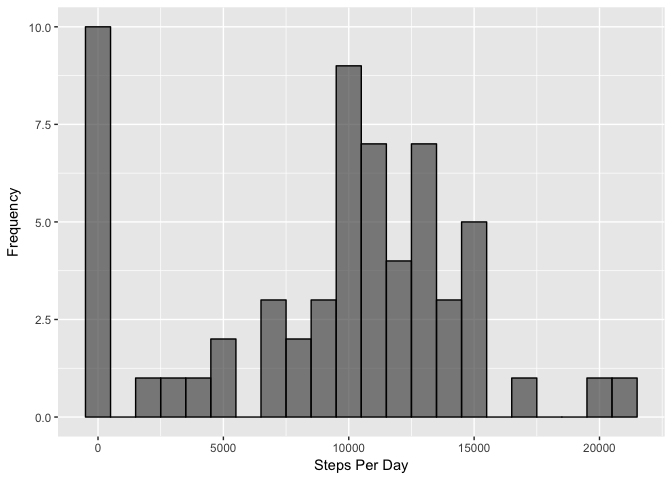
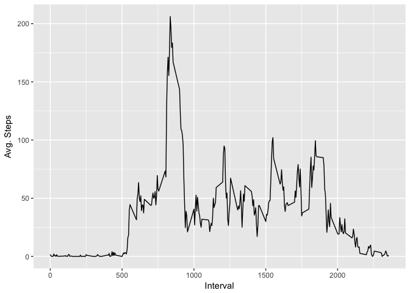
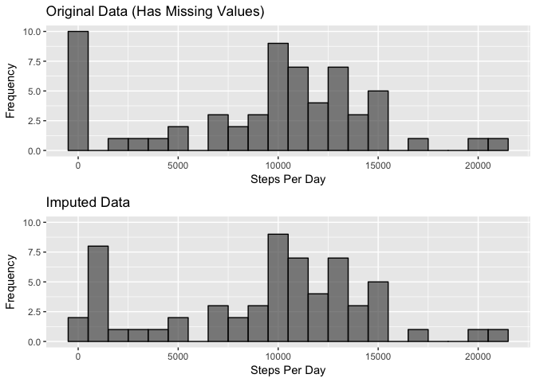
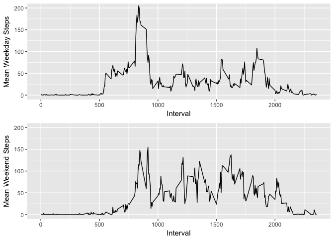

## Loading and preprocessing the data

```r
activity <- read.csv(file = "activity.csv")
```


## What is mean total number of steps taken per day?

Use tapply to sum the steps by the factor "date"; ignore missing values

```r
stepsPerDay <- tapply(activity$steps, activity$date, sum, na.rm=TRUE)
```

Histogram of total number of steps taken per day, in bins of 1000 steps:

```r
library(ggplot2)
qplot(stepsPerDay, xlab = "Steps Per Day", ylab = "Frequency", binwidth = 1000, col = I("black"), alpha = I(0.7))
```

<!-- -->

There are lots of instances of 0 because we ignored the missing values.

Mean:

```r
mean(stepsPerDay)
```

```
## [1] 9354.23
```

Median:

```r
median(stepsPerDay)
```

```
## [1] 10395
```


## What is the average daily activity pattern?
Here is a time series plot showing the average number of steps per interval averaged across all days:


```r
stepsPerInterval <- tapply(activity$steps, activity$interval, mean, na.rm = TRUE)

stepsPerInterval <- data.frame("Interval" = as.numeric(as.character(names(stepsPerInterval))), "MeanSteps" = stepsPerInterval)

row.names(stepsPerInterval) <- NULL # Clean up the data frame

library(ggplot2)
qplot(Interval, MeanSteps, data = stepsPerInterval, geom = "line", xlab = "Interval", ylab = "Avg. Steps")
```

<!-- -->

The interval that contains the maximum number of steps is 835:

```r
which.max(stepsPerInterval$MeanSteps)
```

```
## 835 
## 104
```


## Imputing missing values
There are a total of 2304 missing values in the original dataset:

```r
sum(is.na(activity))
```

```
## [1] 2304
```

How would the data be affected if we imputed the missing values? One possible strategy is to use the median number of steps across all days for a particular interval. That is the strategy I employed here.

First, I calculated the median values for each interval, ignoring missing values:

```r
actImputed <- activity # Make a copy of the original data
medSPI <- tapply(actImputed$steps, actImputed$interval, median, na.rm = TRUE)
medSPI <- data.frame("Interval" = as.numeric(as.character(names(medSPI))), "MedSteps" = medSPI)
row.names(medSPI) <- NULL # Clean up the data frame
```

Then, I looped through each row of the data frame. If there was a missing value for "steps", I set it equal to the median value for that interval:

```r
for(i in 1:nrow(actImputed)) {
      if (is.na(actImputed[i,1])) {
            interval <- actImputed[i,3]
            medSteps <- medSPI[medSPI$Interval == interval,2]
            actImputed[i,1] <- medSteps
      }
}
```

How has imputing affected the results? First, let's calculate the total number of steps for each date for the imputed data (just like we did for the original data).

```r
impSPD <- tapply(actImputed$steps, actImputed$date, sum)
```

The new mean is:

```r
mean(impSPD)
```

```
## [1] 9503.869
```
This value is slightly higher than the mean from the original data. The median is unchanged:

```r
median(impSPD)
```

```
## [1] 10395
```

In order to see the difference in the total number of steps, here is a comparison of two histograms. On the top is the original data, and on the bottom is the imputed data:

```r
library(gridExtra)
library(ggplot2)
stepsPerDay <- as.data.frame(stepsPerDay)
g <- ggplot(data = stepsPerDay, aes(stepsPerDay))
p1 <- g + geom_histogram(binwidth = 1000, col = "black", alpha = .7) + labs(x = "Steps Per Day", y = "Frequency", title = "Original Data (Has Missing Values)") + coord_cartesian(ylim = c(0,10))

impSPD <- as.data.frame(impSPD)
g <- ggplot(data = impSPD, aes(impSPD))
p2 <- g + geom_histogram(binwidth = 1000, col = "black", alpha = .7) + labs(x = "Steps Per Day", y = "Frequency", title = "Imputed Data") + coord_cartesian(ylim = c(0,10))

grid.arrange(p1, p2)
```

<!-- -->


## Are there differences in activity patterns between weekdays and weekends?
The activity patterns vary between weekdays and weekends. We can visualize this first by determining which days are weekdays vs. weekends:


```r
# Convert date column to POSIXct
actImputed$date <- as.POSIXct(actImputed$date)

# Loop through each row and determine if the date is a "weekday" or "weekend"
dayType <- character()
for(i in 1:nrow(actImputed)) {
      day <- weekdays(actImputed$date[i])
      if (day == "Saturday" | day == "Sunday") {
            dayType <- rbind("Weekend", dayType)
      } else {
            dayType <- rbind("Weekday", dayType)
      }
}
# Bind the classification variable
actImputed <- cbind(actImputed, "Day" = dayType)

# Calculate mean steps by interval and by day type
impSPDbyDay <- as.data.frame(tapply(actImputed$steps, list(actImputed$interval, actImputed$Day), mean))

# Clean up the data frame
impSPDbyDay <- data.frame("Interval" = as.numeric(as.character(rownames(impSPDbyDay))), "Weekday" = impSPDbyDay$Weekday, "Weekend" = impSPDbyDay$Weekend)
```

Now we can make a time series plot of Mean Steps vs. Interval for Weekdays and Weekends. I put them on the same scale for easy comparison:

```r
library(ggplot2)
library(gridExtra)

g <- ggplot(data = impSPDbyDay, aes(x = Interval, y = Weekday))
p1 <- g + geom_line() + labs(y = "Mean Weekday Steps") + coord_cartesian(ylim = c(0,200))

g <- ggplot(data = impSPDbyDay, aes(x = Interval, y = Weekend))
p2 <- g + geom_line() + labs(y = "Mean Weekend Steps") + coord_cartesian(ylim = c(0,200))

grid.arrange(p1, p2)
```

<!-- -->

